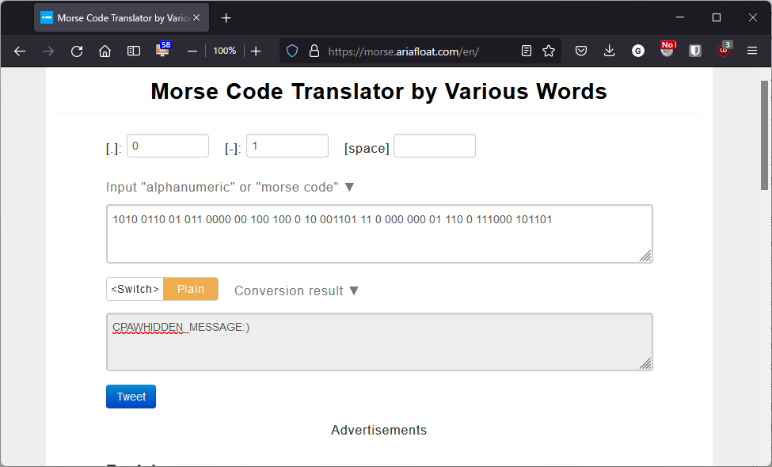

自力解答ならず。  

画像の左上と右下に妙な模様がある。  
2進数を意味しているのかと思い、位置が上の黒点を1、位置が下の黒点を0に置き換えてWeb上の変換ツールを使ってみても、どうやら違うっぽい。  

軽く調べると、そもそもステガノグラフィーとは、画像データそのものに別のデータを巧妙に埋め込んだりそれを抽出したりすることのようだ。  

じゃあと``binwalk``をインストールして使ってみる。  

```bash
$ binwalk -e steg10.jpg

DECIMAL       HEXADECIMAL     DESCRIPTION
--------------------------------------------------------------------------------
0             0x0             JPEG image data, JFIF standard 1.01
30            0x1E            TIFF image data, big-endian, offset of first image directory: 8
```

tiff画像が埋め込まれている？これを取り出そうと試みる。  

```bash
$ steghide extract -sf steg10.jpg
Enter passphrase:
steghide: could not extract any data with that passphrase!
```

パスワードわからん。  

まあ結果的にはモールス信号だったんすがね。  
位置が上の黒点をモールス信号の長点、位置が下の黒点を短点に置き換えて翻訳した結果が以下。  



``cpaw{hidden_message:)}``が答え。  

- 活用したサイト
  - https://morse.ariafloat.com/en/
