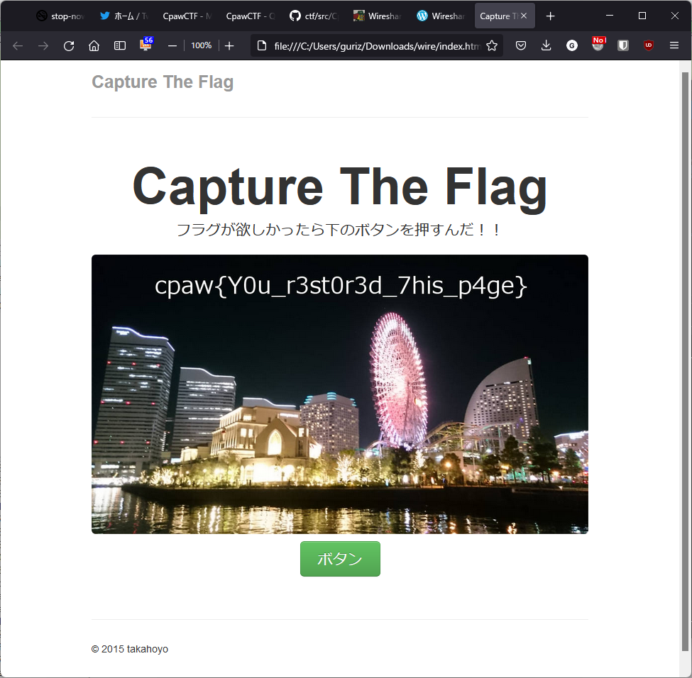

- ``http_traffic.pcap``をWiresharkで開く。
- 画面上部の``ファイル`` -> ``オブジェクトをエクスポート`` -> ``HTTP...`` -> ``すべて保存``で、抜き出したhtmlファイルなどを適当なところに保存。
- ``index.html``の中身を見てみると、cssファイルを``css``フォルダ、jsファイルを``jsフォルダ``、jpgファイルを``img``フォルダに移動すればよいことに気づく。
- ``index.html``をブラウザから開くと以下のように正しく表示される。

- ボタンを押した後。

