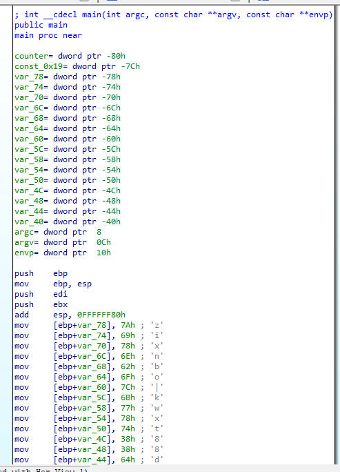
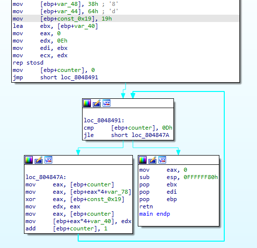

ますは表層解析。  

```bash
$ file rev200
rev200: ELF 32-bit LSB executable, Intel 80386, version 1 (SYSV), dynamically linked, interpreter /lib/ld-linux.so.2, for GNU/Linux 2.6.24, BuildID[sha1]=e87140105d6b5c8ea9b0193380ab3b79bfdcd85b, not stripped
```

次は静的解析。今回はIDAから開く。変数らしき部分に自動でシンボルを割り振ってくれたり分岐構造を図示してくれるからすげえ便利。  
以下はmain関数。  





たぶんこんな雰囲気。  

```c
int main(int argc, char *argv[]) {
  char code[] = "zixnbo|kwxt88d";
  int a = 0x19;
  for (int i = 0; i <= 13; i++) {
    code[i] = code[i] ^ a;
  }
  return 0;
}
```

やってみる。  

```bash
$ python3 decode.py
before: zixnbo|kwxt88d
after: cpaw{vernam!!}
```

バーナム暗号というらしい。  
