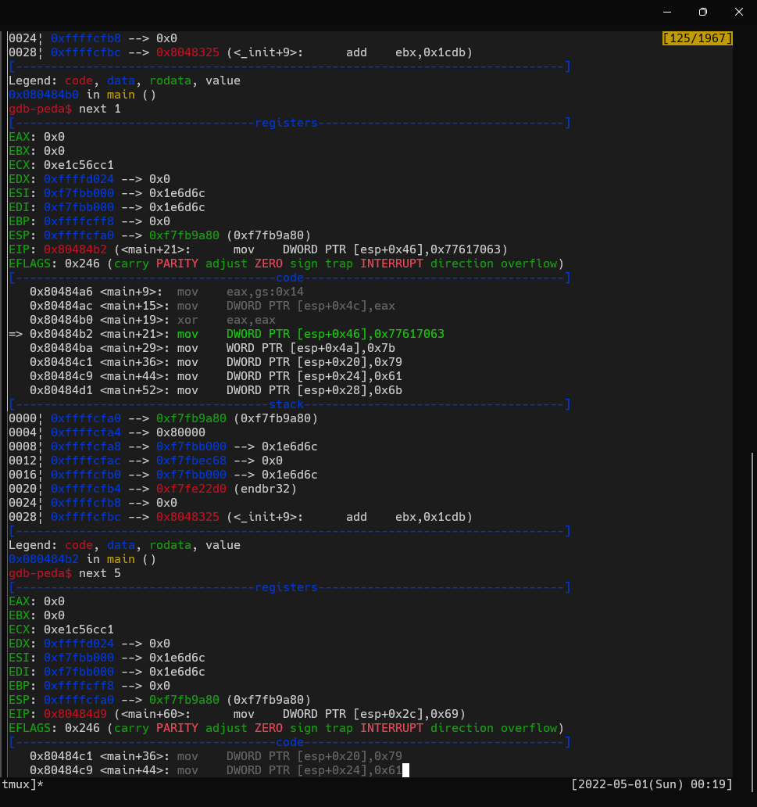
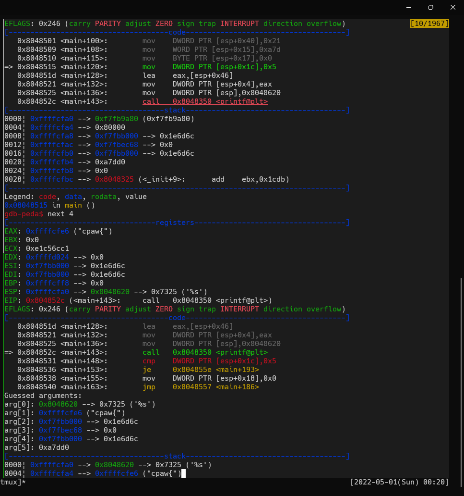

easyじゃないよ。  

わけもわからず``gdb``を使ってみる。  

```bash
chmod +x rev100
gdb ./rev100
```

わけもわからず``next 1``でステップ実行させる。  
すると、なにやらスタックに何らかのデータを連続的に格納してそうな部分に出くわす。  

  

これらの値、ものすげえASCIIコードに見える。  
解読してみた結果は``{yakiniku!``。``DWORD PTR [esp+0x20]``（``y``の部分）以降のオフセットが``0x4``なのに対し、``WORD PTR [esp+0x46]``（``{``の部分）だけアドレス的に孤立してそうな雰囲気。  

もう少し処理を進めてみたら、``cpaw{``を``printf``で表示させようとしている。  

  

さらに勧めたら、同じように``}``を表示させようとしている箇所を見かけた。  
おそらく、先程の``yakiniku!``は``char*``型の変数か何かに格納したまま放ったらかしにしてしまった（という設定）のだろう。  

というわけで``cpaw{yakiniku!}``が答え。  

- 参考リンク
  - [アセンブリ言語入門](http://ext-web.edu.sgu.ac.jp/koike/CA14/assembler_content.html) : 各レジスタと各命令について。
  - [【CTF入門】ELFバイナリのリバースエンジニアリングに入門してみよう](https://yukituna.com/3711/) : ``gdb``のざっくりとした使い方。
  - [文字コード一覧](https://www.alaxala.com/jp/techinfo/archive/manual/AX2400S/HTML/11_7/OPEREF/0008.HTM) : ASCIIコードの確認。
