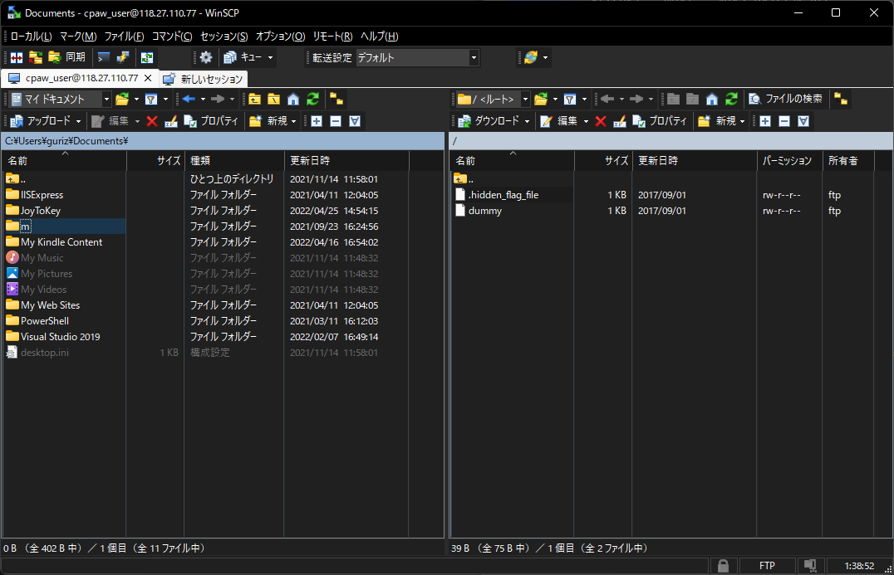

pcapファイルをWiresharkで開く。  
``Protocol``が``DNS``であるパケットのグループが2つ出ているので、接続を2回試行した通信をキャプチャしたものだとわかる。  

2つ目の``DNS``パケットのグループから続く``TCP``パケットを右クリック -> ``追跡`` -> ``TCPストリーム``。  
これで、ログイン可能なユーザ名とパスワードが丸わかり。  

余談だが、パスワードの値がハッシュ値っぽかったので調べてみたら、``password``をハッシュ化した文字列だった。  
https://hashtoolkit.com/decrypt-hash/?hash=5f4dcc3b5aa765d61d8327deb882cf99  

``ftp``コマンドで接続してみる。  

```bash
ftp
ftp> open 118.27.110.77
Connected to 118.27.110.77.
220 Welcome to Cpaw CTF FTP service.
Name (118.27.110.77:guri): 
331 Please specify the password.
Password:
230 Login successful.
```

ログインできたはいいが、``ls``してもタイムアウト。  
はじめて知ったのだが、ftpにはアクティブ接続とパッシブ接続があるらしく、どうやらここのサーバはパッシブ接続しか受け付けていない模様。  
パッシブ接続ができる``WinSCP``を使う。  

て、あれ？``dummy``ファイルしかねえや。ああ、たぶん隠しファイルが見えていないだけか。  
``WinSCP``の上部メニュー -> ``オプション`` -> ``環境設定`` -> ``パネル`` -> ``一般`` -> ``隠しファイルを表示する``を有効化。  
ファイルが無事に表示された。これに記載されているフラグを解答。  

  

## 参考リンク

- [FTPのコマンド一覧](https://atmarkit.itmedia.co.jp/fnetwork/rensai/netpro11/ftp-command.html)
- [ftpコマンドについて詳しくまとめました](https://eng-entrance.com/linux-command-ftp)
