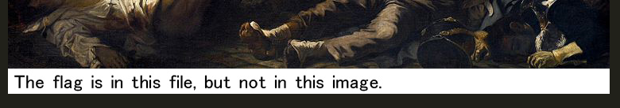

```bash
$ unzip drive.zip
Archive:  drive.zip
  inflating: drive.img
```

中身はimgファイルだったのでマウントしてみる。  

```bash
$ mkdir test
$ sudo mount drive.img test/
$ cd test/ && l
total 272
drwxrwxrwx 1 root root   4096 Jun  3  2012  ./
drwxr-xr-x 5 guri guri   4096 May  4 22:13  ../
-rwxrwxrwx 2 root root  80972 Jun  3  2012 'Carl Larsson Brita as Iduna.jpg'*
-rwxrwxrwx 2 root root  48058 Jun  3  2012 'Mona Lisa.jpg'*
-rwxrwxrwx 2 root root 135599 Jun  3  2012 'The Great Wave off Kanagawa.jpg'*
```

中身はwikipediaから引っ張ってきた名画。実はこれらの画像はミスディレクション。  
イメージをマウントする前に中身を解析しなければならない。  

```bash
$ fls drive.img
r/r 4-128-4:    $AttrDef
r/r 8-128-2:    $BadClus
r/r 8-128-1:    $BadClus:$Bad
r/r 6-128-4:    $Bitmap
r/r 7-128-1:    $Boot
d/d 11-144-4:   $Extend
r/r 2-128-1:    $LogFile
r/r 0-128-1:    $MFT
r/r 1-128-1:    $MFTMirr
r/r 9-128-8:    $Secure:$SDS
r/r 9-144-11:   $Secure:$SDH
r/r 9-144-5:    $Secure:$SII
r/r 10-128-1:   $UpCase
r/r 3-128-3:    $Volume
r/r 35-128-1:   Carl Larsson Brita as Iduna.jpg
r/r 37-128-1:   Mona Lisa.jpg
r/r 38-128-1:   The Great Wave off Kanagawa.jpg
-/r * 36-128-1: Liberty Leading the People.jpg
-/r * 36-128-4: Liberty Leading the People.jpg:00
-/r * 36-128-5: Liberty Leading the People.jpg:01
-/r * 36-128-6: Liberty Leading the People.jpg:02
-/r * 36-128-7: Liberty Leading the People.jpg:03
-/r * 36-128-8: Liberty Leading the People.jpg:04
-/r * 36-128-9: Liberty Leading the People.jpg:05
-/r * 36-128-10:        Liberty Leading the People.jpg:06
V/V 256:        $OrphanFiles
```

先程の名画以外にも画像がある。``inode``番号の左側に``*``が表示されているものは削除済みファイルらしい。``inode``番号を指定してこれらを取り出す。  

```bash
$ icat drive.img 36-128-1 > 1.jpg
$ icat drive.img 36-128-4 > 4.jpg
...
$ icat drive.img 36-128-10 > 10.jpg
```

``1.jpg``は以下のような画像だった。  

  

これ以外はjpg偽装のテキストファイル。つなげて読むことでフラグを入手。  

```bash
cat 4.jpg 5.jpg 6.jpg 7.jpg 8.jpg 9.jpg 10.jpg
```

ファイルを削除したとしても復旧される可能性がある。  

### 参考

- [Forensics入門（CTF） | Qiita](https://qiita.com/knqyf263/items/6ebf06e27be7c48aab2e#%E3%83%87%E3%82%A3%E3%82%B9%E3%82%AF%E3%82%A4%E3%83%A1%E3%83%BC%E3%82%B8%E3%81%8C%E6%B8%A1%E3%81%95%E3%82%8C%E3%81%9F%E5%A0%B4%E5%90%88)
- [fls | Forensicist](http://www.kazamiya.net/SleuthKit/fls)
