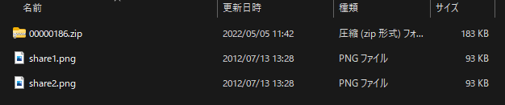
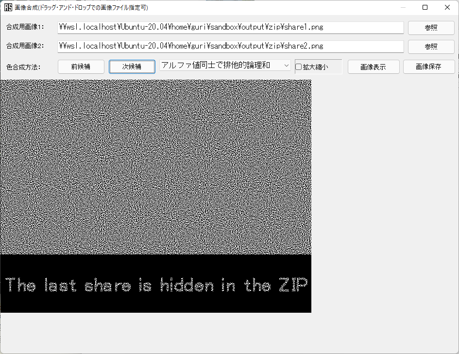
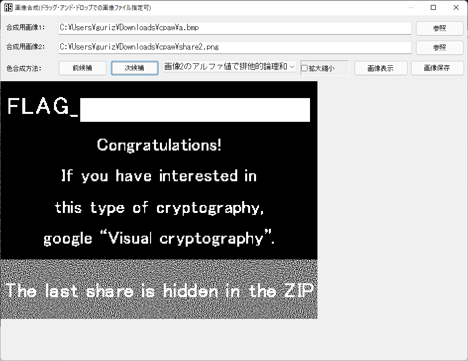

自力解答ならず。  

zip偽装のpngファイルが渡される。  

```bash
$ file secret.zip
secret.zip: PNG image data, 640 x 480, 8-bit/color RGBA, non-interlaced
$ mv secret.zip secret.png
```

zipが中に埋め込まれているので抽出。  

```bash
$ binwalk secret.png

DECIMAL       HEXADECIMAL     DESCRIPTION
--------------------------------------------------------------------------------
0             0x0             PNG image, 640 x 480, 8-bit/color RGBA, non-interlaced
41            0x29            Zlib compressed data, default compression
95256         0x17418         Zip archive data, at least v2.0 to extract, compressed size: 93428, uncompressed size: 94601, name: share1.png
188724        0x2E134         Zip archive data, at least v2.0 to extract, compressed size: 93663, uncompressed size: 94902, name: share2.png
282539        0x44FAB         End of Zip archive, footer length: 22

$ foremost secret.png
Processing: secret.png
D}:y9<W|c]v|re1.ܵ_|q^ͮ]_g_і+M@---kB9jjgn*wmO*JRxJ&z0I1
OkPCdat=share2.png{XfǷ[
    J"&JzSy@)D
*|
```

```bash
$ cd output/zip/

$ l
total 192
drwxr-xr-- 2 guri guri   4096 May  5 11:42 ./
drwxr-xr-- 4 guri guri   4096 May  5 11:42 ../
-rw-r--r-- 1 guri guri 187305 May  5 11:42 00000186.zip

$ file 00000186.zip
00000186.zip: Zip archive data, at least v2.0 to extract
```

展開しようとしたらエラー。  

```bash
$ unzip 00000186.zip
Archive:  00000186.zip
error [00000186.zip]:  missing 95256 bytes in zipfile
  (attempting to process anyway)
error: invalid zip file with overlapped components (possible zip bomb)
```

``zip bomb``で検索したら``高圧縮ファイル爆弾``という攻撃手法が出てきた。  
CTFでマジモンの攻撃ファイルを配ることはないだろうとたかを括り、ホストOSの``7-Zip``で展開。pngファイルが2枚。  

  

``binwalk``や``exiftool``で解析しても怪しそうな箇所はない。画像を見ても真っ黒なだけ。  

ここで汎用バイナリ解析ツール``うさみみハリケーン``に同梱されている``青い空を見上げればいつもそこに白い猫``を使う。  
``share1.png``を``ステガノグラフィー解析`` -> ``画像合成`` -> ``合成用画像2``に``share2.png``を指定 -> ``色合成方法``に``アルファ値同士で排他的論理和``を指定するとこうなる。  

  

ここで詰まる。  

正解は``secret.png``を``foremost``で展開した際に抽出されたpngをもう一枚、上の合成画像に重ね合わせること。  

```bash
guri@alpha: ~/sandbox/output on
$ l png/
total 104
drwxr-xr-- 2 guri guri  4096 May  5 11:42 ./
drwxr-xr-- 4 guri guri  4096 May  5 11:42 ../
-rw-r--r-- 1 guri guri 95256 May  5 11:42 00000000.png # こいつ

guri@alpha: ~/sandbox/output on
$ l zip/
total 384
drwxr-xr-- 2 guri guri   4096 May  5 14:07 ./
drwxr-xr-- 4 guri guri   4096 May  5 11:42 ../
-rw-r--r-- 1 guri guri 187305 May  5 14:36 00000186.zip
-rw-r--r-- 1 guri guri  94601 Jul 13  2012 share1.png # こいつ
-rw-r--r-- 1 guri guri  94902 Jul 13  2012 share2.png # こいつ
```

  

### 参考

- [高圧縮ファイル爆弾 | Wikipedia](https://ja.wikipedia.org/wiki/%E9%AB%98%E5%9C%A7%E7%B8%AE%E3%83%95%E3%82%A1%E3%82%A4%E3%83%AB%E7%88%86%E5%BC%BE)
- [汎用ファイルアナライザ「青い空を見上げればいつもそこに白い猫」（略称：青空白猫）](https://digitaltravesia.jp/usamimihurricane/webhelp/_RESOURCE/MenuItem/another/anotherAoZoraSiroNeko.html)
- [Visual cryptography | Wikipedia](https://en.wikipedia.org/wiki/Visual_cryptography)
- [視覚復号型秘密分散法 | 岩本・渡邉研究室](https://www.iw-lab.jp/users/mitsugu/research/VSSS/main.html)
